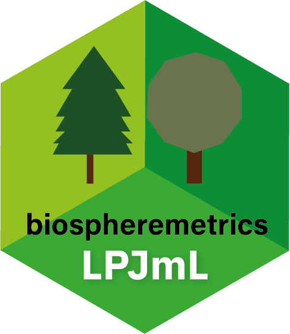

# <a href=''></a> Biosphere integrity metrics for LPJmL

R package **biospheremetrics**, version **1.1.0**

[](https://cran.r-project.org/package=biospheremetrics) [](https://github.com/stenzelf/biospheremetrics/actions) [](https://app.codecov.io/gh/stenzelf/biospheremetrics) [](https://pik-piam.r-universe.dev/builds)

## Purpose and Functionality

Functions to compute Biosphere integrity metrics BioCol and EcoRisk
    based on output from LPJmL.
inst/README.md

## Installation

For installation of the most recent package version an additional repository has to be added in R:

```r
options(repos = c(CRAN = "@CRAN@", pik = "https://rse.pik-potsdam.de/r/packages"))
```
The additional repository can be made available permanently by adding the line above to a file called `.Rprofile` stored in the home folder of your system (`Sys.glob("~")` in R returns the home directory).

After that the most recent version of the package can be installed using `install.packages`:

```r 
install.packages("biospheremetrics")
```

Package updates can be installed using `update.packages` (make sure that the additional repository has been added before running that command):

```r 
update.packages()
```

## Tutorial

The package comes with a vignette describing the basic functionality of the package and how to use it. You can load it with the following command (the package needs to be installed):

```r
vignette("biospheremetrics") # Computing biospheremetrics
```

## Questions / Problems

In case of questions / problems please contact Fabian Stenzel <stenzel@pik-potsdam.de>.

## Citation

To cite package **biospheremetrics** in publications use:

Stenzel F, Breier J, Braun J (2025). "biospheremetrics: Biosphere integrity metrics for LPJmL." Version: 1.1.0, <https://github.com/stenzelf/biospheremetrics>.

A BibTeX entry for LaTeX users is

 ```latex
@Misc{,
  title = {biospheremetrics: Biosphere integrity metrics for LPJmL},
  author = {Fabian Stenzel and Jannes Breier and Johanna Braun},
  date = {2025-05-20},
  year = {2025},
  url = {https://github.com/stenzelf/biospheremetrics},
  note = {Version: 1.1.0},
}
```
